# SparkFun-VR-IMU-Breakout-BNO086-Qwiic-SPI

# Introduction
This setup for **BNO086 (via I2C)** with the **STM32G474RE**, allowing simultaneous data collection. Data from IMU is publishes by using micro-ROS (UROS).

#### Reference 
- BNO086: **[Product and Documents](https://www.sparkfun.com/products/22857)**

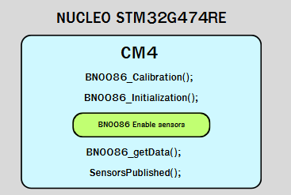

# Installation

1. Install **micro_ros_agent** follow by this reference : 
**[Visit Github](https://github.com/micro-ROS/micro_ros_setup)**

    **!! Choose the branch that match to your ROS Distro (Humble, etc)**

2. Git clone the STM32CubeIDE project into your workspace.
```bash
git clone https://github.com/CARVER-NEXT-GEN/SparkFun-VR-IMU-Breakout-BNO086-Qwiic-SPI.git
```

3. Open ST32CubeIDE in your workspace and open project "G4_BNO086_UROS_UART" from file system

4. Open properties in ***G4_BNO086_UROS_UART*** -> C/C++ Build -> Setting -> Build Steps -> Pre-build steps -> Command and add (Replace <span style="color: red;">***YOUR_UBUNTU_PASSWORD***</span> to your current ubuntu password):
```
echo "YOUR_UBUNTU_PASSWORD" | sudo -S chmod 666 /var/run/docker.sock && docker pull microros/micro_ros_static_library_builder:humble && docker run --rm -v ${workspace_loc:/${ProjName}}:/project --env MICROROS_LIBRARY_FOLDER=micro_ros_stm32cubemx_utils/microros_static_library_ide microros/micro_ros_static_library_builder:humble
```
5. Delete folder "micro_ros_stm32cubemx_utils" and re-add by git clone in this path
```bash
cd SparkFun-VR-IMU-Breakout-BNO086-Qwiic-SPI.git/G4_BNO086_UROS_UART

git clone -b humble https://github.com/micro-ROS/micro_ros_stm32cubemx_utils.git
```

# Usage

1.Start **micro_ros_agent** to debug the system every time.

```bash
ros2 run micro_ros_agent micro_ros_agent serial --dev "$device" -b 2000000
```

** !! Replace **$device** with your port device by checking from following command
```bash
ls /dev/tty*
```

For me, It's **ttyACM0**

```bash
ros2 run micro_ros_agent micro_ros_agent serial --dev ttyACM0 -b 2000000
```

2. Include library in main.c
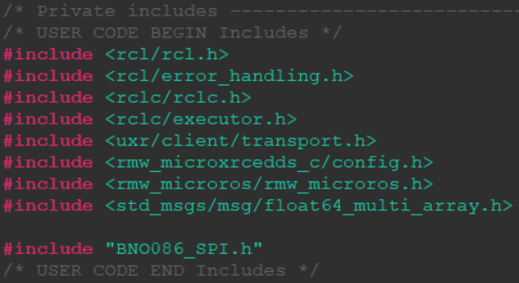


3. Define the macro function to check the **RC Status** and **HAL Status** with condition
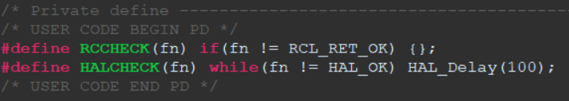

4. Declare ***BNO086_t IMU_086_FRTOS*** sensor object and other ROS object in ***/ * USER CODE BEGIN PV * /*** 

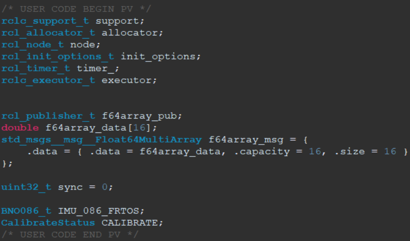

5. Use these functions in ***/ * USER CODE BEGIN 2 * /***
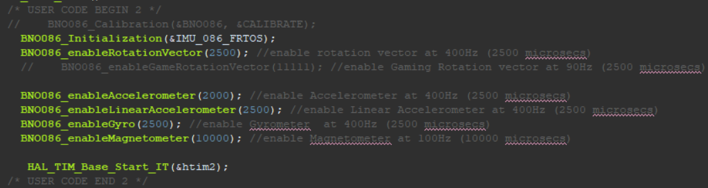
- **BNO086_Calibration(&CALIBRATE) :** You can press B1 Button before power up to enter calibration mode. The steps are provided below if a user wants to force a calibration.
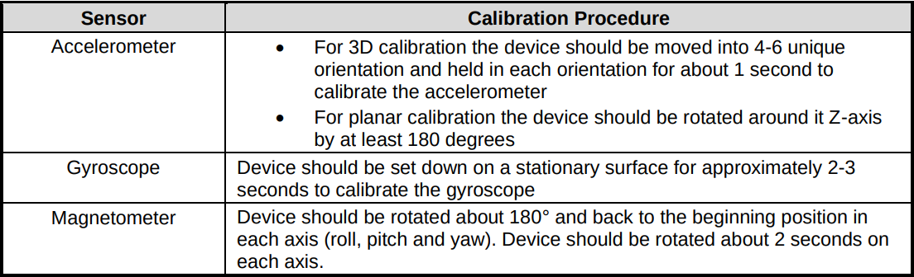
when you calibrate finish press B1 button again for exit from calimration mode.
- **BNO086_Initialization(&BNO086) :** This function for initialize sensors and prepare sensor to ready for send data.
- **BNO086_enableRotationVector(2500) :** This is for enable Rotation vector to see data quaternion and turn to roll, pitch, yaw. It have output from 9-axis sensor fusion.
- **BNO086_enableGameRotationVector(11111) :** This is for enable Game Rotation Vector to see data quaternion. It different from Rotation vector that it not use  magnetometer in sensor fusion. 
- **BNO086_enableAccelerometer(2000) :** This is for enable Accelerometer to see acceleration that include gravity each axis. 
- **BNO086_enableLinearAccelerometer(2500) :** This is for enable Linear Accelerometer to see acceleration that not include gravity each axis. 
- **BNO086_enableGyro(2500) :** This is for enable Gyrometer to see velocity each axis.
- **BNO086_enableMagnetometer(10000) :** This is for enable Magnetometer to see magnatic field in each axis.
- **HAL_TIM_Base_Start_IT(&htim2) :** This is for start timer interupt for control frequancy to get data from sensors.

**Note :** each enable sensor have maximum data rate for read data. You can see in picture below
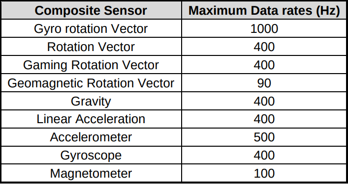
You can calcurate frequancy in Hz to period time in microsecond and add in function enable each sensors as parametors.

6.  Getting data from sensor: You can work on it by Timer Interrupt to control the frequency.
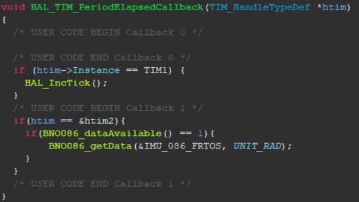
- **BNO086_getData(&IMU_086_FRTOS, UNIT_RAD) :** This is function that get data from IMU. You can change unit of roll pitch yaw by change UNIT_RAD or UNIT_DEG.

**Note:** This is function for control frequancy to get data from sensors, It have 1000 Hz as default.

7. At **void timer_callback** where is a control loop in UROS, 
    - **SensorsPublished()**: Extract the **BNO086 data** and publish in ROS2.
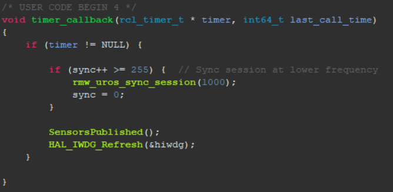

8. This is an example of initialize the node, executor, timer and publishers to publish the data (Using best_effort). And define the header frame id.
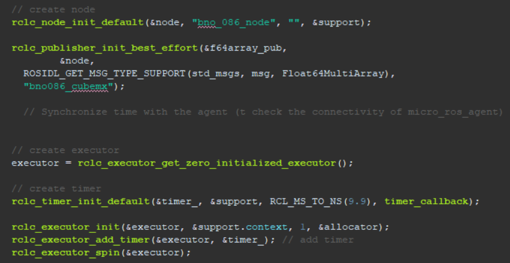

9. Create functions for extract both of sensors and publish the data. (You also can create a custom message interface to handle the additional data e.g. **Accerelation** and **Euler Angle**)
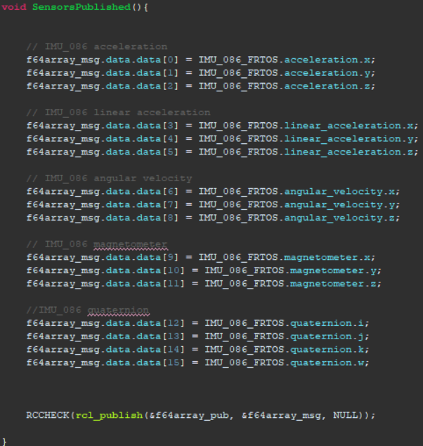

# Pinout NUCLEO-G474RE with BNO086
## Pinout connect86 with NUCLEO-G474RE
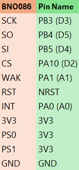
## Pinout NUCLEO-G474RE
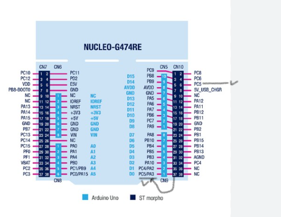

[**STM32H7 Nucleo-144 boards (MB1363) - User manual**](https://www.st.com/resource/en/user_manual/um2408-stm32h7-nucleo144-boards-mb1363-stmicroelectronics.pdf)

# IOC Setup in NUCLEO-H745ZI-Q with BNO055

## GPIO
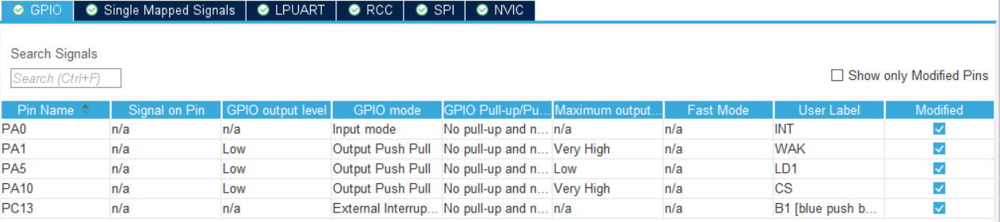
## SPI
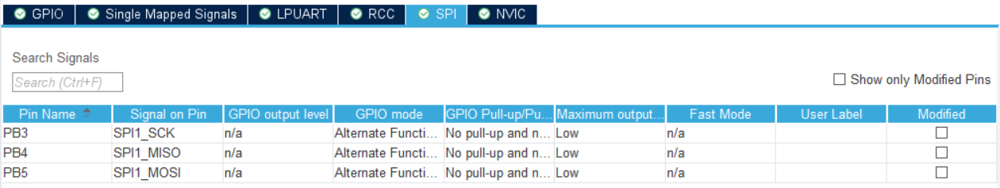
## Timer
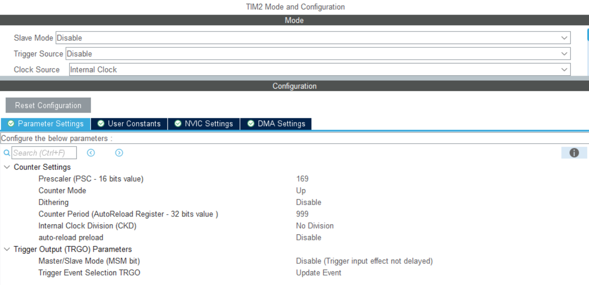
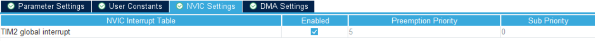
## UART
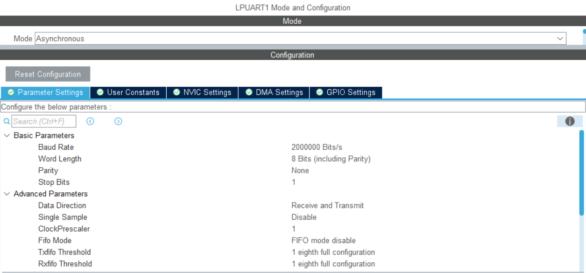
