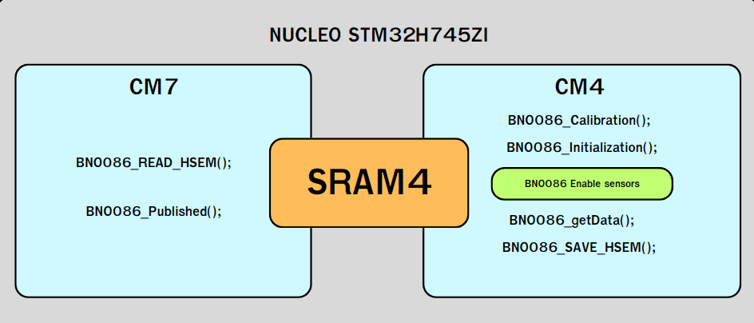

# SparkFun-VR-IMU-Breakout-BNO086-Qwiic-SPI

# Introduction

This setup for BNO086 (via SPI) with the STM32H745ZI-Q. Data from this IMU is sent from the CM4 core to the CM7 core, where CM7 publishes it using micro-ROS (UROS).

#### Reference 
- BNO086: **[Product and Documents](https://www.sparkfun.com/products/22857)**



# Installation

1. Install **micro_ros_agent** follow by this reference : 
**[Visit Github](https://github.com/micro-ROS/micro_ros_setup)**

    **!! Choose the branch that match to your ROS Distro (Humble, etc)**

2. Git clone the STM32CubeIDE project into your workspace.
```bash
git clone -b H745_UROS_UART https://github.com/CARVER-NEXT-GEN/SparkFun-VR-IMU-Breakout-BNO086-Qwiic-SPI.git
```

3. Open ST32CubeIDE in your workspace and open project "BNO086_H745_UROS_UART" from file system

4. Open properties in ***BNO086_H745_UROS_UART_CM7(in CM7)*** -> C/C++ Build -> Setting -> Build Steps -> Pre-build steps -> Command and add (Replace ***YOUR_UBUNTU_PASSWORD*** to your current ubuntu password):
```
echo "YOUR_UBUNTU_PASSWORD" | sudo -S chmod 666 /var/run/docker.sock && docker pull microros/micro_ros_static_library_builder:humble && docker run --rm -v ${workspace_loc:/${ProjName}}:/project --env MICROROS_LIBRARY_FOLDER=micro_ros_stm32cubemx_utils/microros_static_library_ide microros/micro_ros_static_library_builder:humble
```
5. Delete folder "micro_ros_stm32cubemx_utils" in CM7 and re-add by git clone in this path
```bash
cd SparkFun-VR-IMU-Breakout-BNO086-Qwiic-SPI/BNO086_H745_UROS_UART/CM7

git clone -b humble https://github.com/micro-ROS/micro_ros_stm32cubemx_utils.git
```
6. Right click on ***BNO086_H745_UROS_UART_CM7(in CM7)*** and click on **Clean Project**


7. Next, Right click on ***BNO086_H745_UROS_UART_CM7(in CM7)*** again and click on **Build Project**


8. Click once at ***BNO086_H745_UROS_UART_CM7(in CM7)*** in Project Explorer and Open **Debug Configuration** 


    
    and **double click at STM32 C/C++ Application** and BNO086_H745_UROS_UART_CM7 Debug that you click once before will appear.
    
    **Note: If the previous debugger appered, Right click on it and press delete** 


Click in **BNO086_H745_UROS_UART_CM7 Debug** and go to Startup, click Add.. -> Project -> BNO086_H745_UROS_UART_CM4 (Make sure you've checked the checkbox along the picture) and then press OK the Apply


# Usage

## CM4

1.Start **micro_ros_agent** to debug the system at CM7 every time.

```bash
ros2 run micro_ros_agent micro_ros_agent serial --dev "$device" -b 2000000
```

** !! Replace **$device** with your port device by checking from following command
```bash
ls /dev/tty*
```

For me, It's **ttyACM0**

```bash
ros2 run micro_ros_agent micro_ros_agent serial --dev ttyACM0 -b 2000000
```

2. Include library in main.c of CM4


3. Define 2 object **BNO086** and **CALIBRATE**


4. Use function in BEGIN2

    - **BNO080_Calibration(&CALIBRATE) :** You can press B1 Button before power up to enter calibration mode. The steps are provided below if a user wants to force a calibration.
    
    when you calibrate finish press B1 button again for exit from calimration mode.
    - **BNO080_Initialization(&BNO086) :** This function for initialize sensors and prepare sensor to ready for send data.
    - **BNO080_enableRotationVector(2500) :** This is for enable Rotation vector to see data quaternion and turn to roll, pitch, yaw. It have output from 9-axis sensor fusion.
    - **BNO080_enableGameRotationVector(11111) :** This is for enable Game Rotation Vector to see data quaternion. It different from Rotation vector that it not use  magnetometer in sensor fusion. 
    - **BNO080_enableAccelerometer(2000) :** This is for enable Accelerometer to see acceleration that include gravity each axis. 
    - **BNO080_enableLinearAccelerometer(2500) :** This is for enable Linear Accelerometer to see acceleration that not include gravity each axis. 
    - **BNO080_enableGyro(2500) :** This is for enable Gyrometer to see velocity each axis.
    - **BNO080_enableMagnetometer(10000) :** This is for enable Magnetometer to see magnatic field in each axis.
    - **HAL_TIM_Base_Start_IT(&htim2) :** This is for start timer interupt for control frequancy to get data from sensors.

    **Note :** each enable sensor have maximum data rate for read data. You can see in picture below
    
    You can calcurate frequancy in Hz to period time in microsecond and add in function enable each sensors as parametors.

5. Getting data from sensor: You can work on it by Infinite loop (USER CODE BEGIN 3) or using Timer Interrupt to control the frequency. 


    Timer Interrupt (For now, We're using timer interrupt)

This is function for control frequancy to get data from sensors, It have 1000 Hz as default.

## CM7

1. Switch to **main.c** in ***BNO086_H745_UROS_UART_CM4 (in CM7)***. Declare the **BNO086_t IMU_086** which is the object used to receive the data from CM4.

    

2. At **void timer_callback** where is a control loop in UROS, 
    - **BNO086_READ_HSEM(&IMU_086)** : Read the data from CM4 and store in the **IMU_086** object.
    - **BNO086_Published()**: Extract the data and publish in ROS2 (Optional)

    

3. This is an example of initialize the publishers to publish the data (Using best_effort)


4. Create function for extract and publish the data. (You also can create a custom message interface to handle the additional data e.g. **Accerelation** and **Euler Angle**)
 

5. When you already debugged, you can add these below in **Live Expression**
   - **BNO086** for see data from sensor
   - **imu** for check CM7 that can read data from CM4 it will has same data as BNO086
   - **CALIBRATE**  for see status sensors when you enter calibration mode
        - **accuracyQuat**, **accuracyAccel**, **accuracyGyro**, **accuracyMag** : for see status accuracy each sensors
            - IDLE : when sensor not in calibration mode
            - UNRELIABLE -> LOW -> MEDIUM -> HIGH : it is status of sensor
        - **CalibrationData** : for check data from calibrate that can stored in flash memory
            - SUCCESSFUL : can stored data
            - FAIELD : can't stored data. please try again.


6. Inspect the data publisher by checking topic in terminal.
```bash
ros2 node list
```


```bash
ros2 topic list
```


Try echo some topic:
```bash
ros2 topic echo /BNO086_IMU_Publihser 
```


# Pinout NUCLEO-H745ZI-Q with BNO086
## Pinout connect BNO086 with NUCLEO-H745ZI-Q

## Pinout NUCLEO-H745ZI-Q


[**STM32H7 Nucleo-144 boards (MB1363) - User manual**](https://www.st.com/resource/en/user_manual/um2408-stm32h7-nucleo144-boards-mb1363-stmicroelectronics.pdf)

# Rotation angle convention of BNO086
