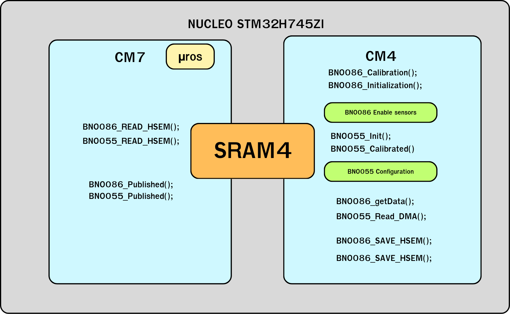
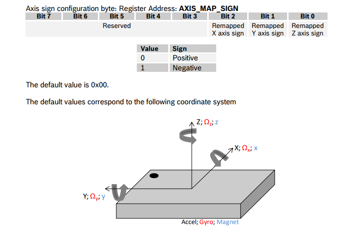
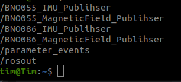

# Integrate ***Adafruit-9-DOF-Absolute-Orientation-IMU-Fusion-Breakout-BNO055-I2C*** with ***SparkFun-VR-IMU-Breakout-BNO086-Qwiic-SPI***


# Introduction
This setup integrates the **BNO055 (via I2C)** and **BNO086 (via SPI)** with the **STM32H745ZI-Q**, allowing simultaneous data collection. Data from both IMUs is sent from the CM4 core to the CM7 core, where CM7 publishes it using micro-ROS (UROS).

#### Reference 
- BNO086: **[Product and Documents](https://www.sparkfun.com/products/22857)**
- BNO055: **[Product and Description](https://www.arduitronics.com/product/1281/adafruit-9-dof-absolute-orientation-imu-fusion-breakout-bno055-made-in-usa)** , **[Document](https://cdn-shop.adafruit.com/datasheets/BST_BNO055_DS000_12.pdf)**  



# Installation

1. Install **micro_ros_agent** follow by this reference : 
**[Visit Github](https://github.com/micro-ROS/micro_ros_setup)**

    **!! Choose the branch that match to your ROS Distro (Humble, etc)**

2. Git clone the STM32CubeIDE project into your workspace.
```bash
git clone -b Integrate-with-BNO055-UROS-UART https://github.com/CARVER-NEXT-GEN/SparkFun-VR-IMU-Breakout-BNO086-Qwiic-SPI.git
```

3. Open ST32CubeIDE in your workspace and open project "BNO086_H745_UROS_UART" from file system

4. Open properties in ***BNO086_BNO055_UROS_UART(in CM7)*** -> C/C++ Build -> Setting -> Build Steps -> Pre-build steps -> Command and add (Replace <span style="color: red;">***YOUR_UBUNTU_PASSWORD***</span> to your current ubuntu password):
```
echo "YOUR_UBUNTU_PASSWORD" | sudo -S chmod 666 /var/run/docker.sock && docker pull microros/micro_ros_static_library_builder:humble && docker run --rm -v ${workspace_loc:/${ProjName}}:/project --env MICROROS_LIBRARY_FOLDER=micro_ros_stm32cubemx_utils/microros_static_library_ide microros/micro_ros_static_library_builder:humble
```
5. Delete folder "micro_ros_stm32cubemx_utils" in CM7 and re-add by git clone in this path
```bash
cd SparkFun-VR-IMU-Breakout-BNO086-Qwiic-SPI/BNO086_BNO055_UROS_UART/CM7

git clone -b humble https://github.com/micro-ROS/micro_ros_stm32cubemx_utils.git
```
6. Right click on ***BNO086_BNO055_UROS_UART(in CM7)*** and click on **Clean Project**


7. Next, Right click on ***BNO086_BNO055_UROS_UART(in CM7)*** again and click on **Build Project**


8. Click once at ***BNO086_BNO055_UROS_UART(in CM7)*** in Project Explorer and Open **Debug Configuration** 


    
    and **double click at STM32 C/C++ Application** and BNO086_BNO055_UROS_UART Debug that you click once before will appear.
    
    **Note: If the previous debugger appered, Right click on it and press delete** 


Click in **BNO086_BNO055_UROS_UART_CM7 Debug** and go to Startup, click Add.. -> Project -> BNO086_H745_UROS_UART_CM4 (Make sure you've checked the checkbox along the picture) and then press OK the Apply


# Usage

1.Start **micro_ros_agent** to debug the system at CM7 every time.

```bash
ros2 run micro_ros_agent micro_ros_agent serial --dev "$device" -b 2000000
```

** !! Replace **$device** with your port device by checking from following command
```bash
ls /dev/tty*
```

For me, It's **ttyACM0**

```bash
ros2 run micro_ros_agent micro_ros_agent serial --dev ttyACM0 -b 2000000
```

## CM4 Project
2. Include library in main.c of CM4


### Initialize in each sensor

3. **BNO086**
    
    3.1 Declare 2 objects, **BNO086** and **CALIBRATE** in ***/ * USER CODE BEGIN PV * /***

    

    3.2 Use these functions in ***/ * USER CODE BEGIN 2 * /***

    

    - **BNO080_Calibration(&CALIBRATE) :** You can press B1 Button before power up to enter calibration mode. The steps are provided below if a user wants to force a calibration.
    
    when you calibrate finish press B1 button again for exit from calimration mode.
    - **BNO080_Initialization(&BNO086) :** This function for initialize sensors and prepare sensor to ready for send data.
    - **BNO080_enableRotationVector(2500) :** This is for enable Rotation vector to see data quaternion and turn to roll, pitch, yaw. It have output from 9-axis sensor fusion.
    - **BNO080_enableGameRotationVector(11111) :** This is for enable Game Rotation Vector to see data quaternion. It different from Rotation vector that it not use  magnetometer in sensor fusion. 
    - **BNO080_enableAccelerometer(2000) :** This is for enable Accelerometer to see acceleration that include gravity each axis. 
    - **BNO080_enableLinearAccelerometer(2500) :** This is for enable Linear Accelerometer to see acceleration that not include gravity each axis. 
    - **BNO080_enableGyro(2500) :** This is for enable Gyrometer to see velocity each axis.
    - **BNO080_enableMagnetometer(10000) :** This is for enable Magnetometer to see magnatic field in each axis.
    - **HAL_TIM_Base_Start_IT(&htim2) :** This is for start timer interupt for control frequancy to get data from sensors.

    *   *Note :** each enable sensor have maximum data rate for read data. You can see in picture below
        
        You can calcurate frequancy in Hz to period time in microsecond and add in function enable each sensors as parametors.

      - **CALIBRATE**  for see status sensors when you enter calibration mode
        - **accuracyQuat**, **accuracyAccel**, **accuracyGyro**, **accuracyMag** : for see status accuracy each sensors
            - IDLE : when sensor not in calibration mode
            - UNRELIABLE -> LOW -> MEDIUM -> HIGH : it is status of sensor
        - **CalibrationData** : for check data from calibrate that can stored in flash memory
            - SUCCESSFUL : can stored data
            - FAIELD : can't stored data. please try again.

        

4. **BNO055**

    4.1 Define the macro function to check the **HAL Status** with condition
    

    4.2 Declare only ***BNO055*** sensor object in ***/ * USER CODE BEGIN PV * /*** 
    
    

    4.3 Use these functions in ***/ * USER CODE BEGIN 2 * /***
    

    - **HALCHECK(BNO055_Init(&BNO055, &hi2c1, 0, NDOF)):** Initialize the **BNO055** sensor with I2C1
    
        - For the third parametor is set to 0 which mean to set the hardware register address (0 = 0b101000b) as the picture above.
        If you're not wiring the **ADDR pin** in **Adafruit BNO055 board** (watch the schematic diagram below)
        
        

    - **BNO055_Calibrated(&BNO055, &BNO055_stat, &BNO055_off):** For calibration, You have to define the macro define **BNO_CALIB_ON** to enable the calibration mode.
    To do that, Let's look up the ***Common/BNO055_I2C*** directory which contain by ***BNO055_config.h*** and ***BNO055_config.c*** 
    
        - in ***BNO055_config.h*** 

        
        - You will see the macro definition **BNO_CALIB_OFF** which play role as switch toggle. Change to **BNO_CALIB_ON** for enter the calibration mode
        - Additional definitions specify the offset for each sensor, enabling data to be sent back to the sensor for computation.
         To receive the offset data, use **debug** and input the **BNO055_off** into the live expression to inspect the offset data and set the value.
        
        
        - in ***BNO055_config.c*** 
        
        

        - Illustrate the offset struct object to store the offset data from **BNO055** and declare the Calibration status object when toggle the ***BNO_CALIB_ON***
        - You can calibrate follow by instruction in datasheet to achieve all of the calcurate status as **HAL_OK**
        
        
    - **BNO055_SetOffsets(&BNO055, &BNO055_off):** Register the offset value from calibration to the sensor.
    - **BNO055_SetAxis(&BNO055, P0_Config, P0_Sign):** Use to map and re-sign the axis follow by the instruction below.

        - Remapping each axis (redefining the axis orientation).
        

        - Adjust the sign (positive or negative) of each axis direction.
        

        - The setup configuration will look like this.
        

        - Now you can input the config by this macro:

             
5. Getting data from the sensor: Use a timer interrupt to control the frequency and ensure non-blocking processing. Also, use the I2C DMA callback function to save the data to memory (on CM7) after transfer completion.
` 
This is function for control frequancy to get data from sensors, It have 1000 Hz as default.

6. Switch to **main.c** in ***BNO086_H745_UROS_UART_CM4 (in CM7)***. Declare the **BNO086_t IMU_086** at  ***/ * USER CODE BEGIN PV * /***   which is the object used to receive the data from CM4.

    

7. At **void timer_callback** where is a control loop in UROS, 
    - **BNO086_READ_HSEM(&IMU_086)** : Read the data from CM4 and store in the **IMU_086** object.
    - **BNO086_Published()**: Extract the **BNO086 data** data and publish in ROS2 (Optional)
    - **BNO055_READ_HSEM(&IMU_055)** : Read the data from CM4 and store in the **IMU_055** object.
    - **BNO055_Published()**: Extract the **BNO055 data** and publish in ROS2 (Optional)

       
    

8. This is an example of initialize the publishers to publish the data (Using best_effort). And define the header frame id.


9. Create functions for extract both of sensors and publish the data. (You also can create a custom message interface to handle the additional data e.g. **Accerelation** and **Euler Angle**)
 
 

10. When you already debugged, you can add these below in **Live Expression**
   - **BNO086** and **BNO055** for see data from sensor
   - **IMU_086** and **IMU_055** for check CM7 that can read data from CM4 it will has same data as BNO086
 


11. Inspect the data publisher by checking topic in terminal.
```bash
ros2 node list
```


```bash
ros2 topic list
```


Try echo some topic:
```bash
ros2 topic echo /BNO086_IMU_Publihser 
```


# Pinout NUCLEO-H745ZI-Q with BNO086 and BNO055
## Pinout connect BNO086 and BNO055 with NUCLEO-H745ZI-Q

## Pinout NUCLEO-H745ZI-Q


[**STM32H7 Nucleo-144 boards (MB1363) - User manual**](https://www.st.com/resource/en/user_manual/um2408-stm32h7-nucleo144-boards-mb1363-stmicroelectronics.pdf)

# Rotation angle conventions of BNO055

Use **Window format**


# Rotation angle convention of BNO086
- **Roll :** range +/- 180˚
- **Pitch :** range +/- 90˚
-  **Yaw :** range +/- 180˚

**Rotation axis like lable on BNO086**