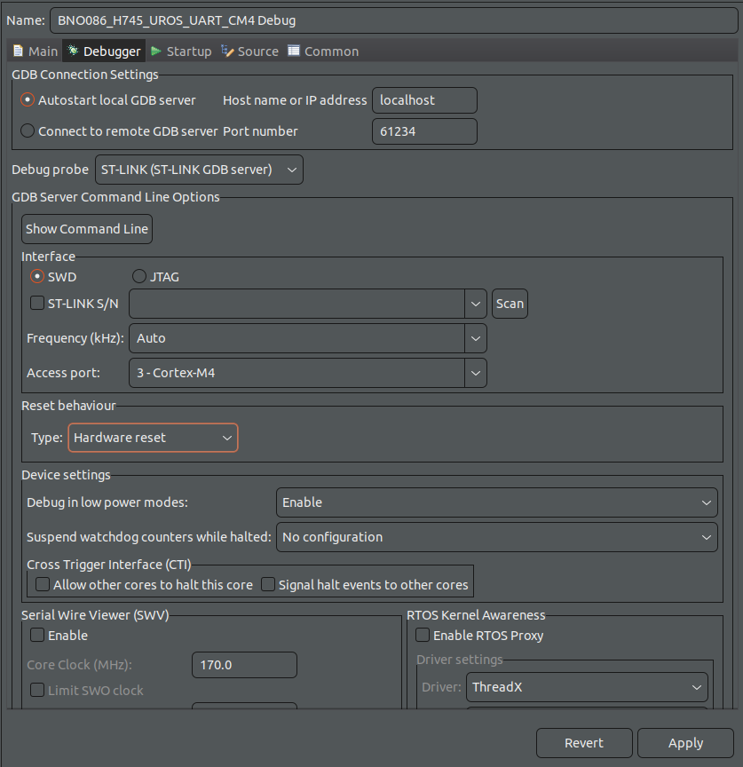

# SparkFun-VR-IMU-Breakout-BNO086-Qwiic-SPI

## Introduction


## Installation

1. Git clone in your workspace
```bash
git clone -b H745_UROS_UART https://github.com/CARVER-NEXT-GEN/SparkFun-VR-IMU-Breakout-BNO086-Qwiic-SPI.git
```

2. Open ST32CubeIDE in your workspace and open project "BNO086_H745_UROS_UART" from file system

3. Open properties in CM7 -> C/C++ Build -> Setting -> Build Steps -> Pre-build steps -> Command and add:
```
echo "YOUR_PASSWORD_COM" | sudo -S chmod 666 /var/run/docker.sock && docker pull microros/micro_ros_static_library_builder:humble && docker run --rm -v ${workspace_loc:/${ProjName}}:/project --env MICROROS_LIBRARY_FOLDER=micro_ros_stm32cubemx_utils/microros_static_library_ide microros/micro_ros_static_library_builder:humble
```
4. Delete folder "micro_ros_stm32cubemx_utils" in CM7 and re-add by git clone in this path
```bash
cd SparkFun-VR-IMU-Breakout-BNO086-Qwiic-SPI/BNO086_H745_UROS_UART/CM7

git clone -b humble https://github.com/micro-ROS/micro_ros_stm32cubemx_utils.git
```
5. Click once at "BNO086_H745_UROS_UART_CM7(in CM7)" in Project Explorer and Open Debug Configuration 

and double click at STM32 C/C++ Application and CM7 that you click once before will appear. 

Click in BNO086_H745_UROS_UART_CM7 Debug and go to Startup, click Add.. -> Project -> BNO086_H745_UROS_UART_CM4 and press OK the Apply

6. Click once at "BNO086_H745_UROS_UART_CM4(in CM4)" in Project Explorer and Open Debug Configuration and double click at STM32 C/C++ Application (same as CM7) -> BNO086_H745_UROS_UART_CM4 Debug -> Debugger -> Reset behaviour -> change Type to "Hardware reset" 

and go to Startup -> Add.. -> Project -> BNO086_H745_UROS_UART_CM7 and press OK the Apply and Close


## Usage

1. Now you can Debug project but you must start debug at CM7 every time

2. Include library in main.c of CM4


3. Define 2 object **BNO086** and **CALIBRATE**


4. Use function in BEGIN2

    - **BNO080_Calibration(&CALIBRATE) :** You can press B1 Button before power up to enter calibration mode. The steps are provided below if a user wants to force a calibration.
    
    when you calibrate finish press B1 button again for exit from calimration mode.
    - **BNO080_Initialization(&BNO086) :** This function for initialize sensors and prepare sensor to ready for send data.
    - **BNO080_enableRotationVector(2500) :** This is for enable Rotation vector to see data quaternion and turn to roll, pitch, yaw. It have output from 9-axis sensor fusion.
    - **BNO080_enableGameRotationVector(11111) :** This is for enable Game Rotation Vector to see data quaternion. It different from Rotation vector that it not use  magnetometer in sensor fusion. 
    - **BNO080_enableAccelerometer(2000) :** This is for enable Accelerometer to see acceleration that include gravity each axis. 
    - **BNO080_enableLinearAccelerometer(2500) :** This is for enable Linear Accelerometer to see acceleration that not include gravity each axis. 
    - **BNO080_enableGyro(2500) :** This is for enable Gyrometer to see velocity each axis.
    - **BNO080_enableMagnetometer(10000) :** This is for enable Magnetometer to see magnatic field in each axis.
    - **HAL_TIM_Base_Start_IT(&htim2) :** This is for start timer interupt for control frequancy to get data from sensors.

    **Note :** each enable sensor have maximum data rate for read data. You can see in picture below
    
    You can calcurate frequancy in Hz to period time in microsecond and add in function enable each sensors as parametors.

5. Optionnal

You can add infinite loop for get sensor data In BEGIN 3 for customize frequancy of loop or something else.

6. Timer Interrupt

This is function for control frequancy to get data from sensors, It have 1000 Hz as default.

7. When you already debug you can add these below in Live Expression
   - **BNO086** for see data from sensor
   - **imu** for check CM7 that can read data from CM4 it will has same data as BNO086
   - **CALIBRATION**  for see status sensors when you enter calibration mode
        - **accuracyQuat**, **accuracyAccel**, **accuracyGyro**, **accuracyMag** : for see status accuracy each sensors
            - IDLE : when sensor not in calibration mode
            - UNRELIABLE -> LOW -> MEDIUM -> HIGH : it is status of sensor
        - **CalibrationData** : for check data from calibrate that can stored in flash memory
            - SUCCESSFUL : can stored data
            - FAIELD : can't stored data. please try again.


